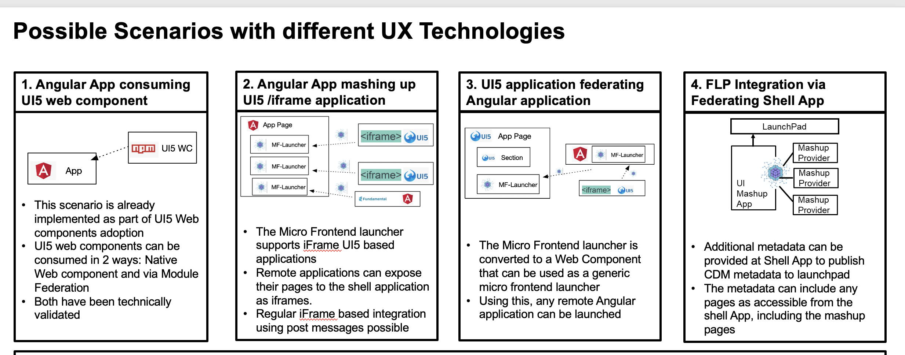

## This repository contains source code for 3 scenarious



### Deployed versions
1. [Angular App consuming UI5 web component](https://demo01-ui5wc-in-angular.web.app/)
2. [Angular App mashing up UI5/iframe application](https://demo02-ng-mashing-app-with-ui5.web.app/)
3. [UI5 application federating Angular application](https://ngel-in-sapui5.web.app/)

### Details
#### 1. Angular App consuming UI5 web component
Web Components provided by ui5 wc team via npm, imported as JS files into Angular component and used in template

```typescript
import { Component } from '@angular/core';

import '@ui5/webcomponents-icons/dist/phone';
import '@ui5/webcomponents-icons/dist/calendar';
import '@ui5/webcomponents-fiori/dist/Timeline';
import '@ui5/webcomponents-fiori/dist/TimelineItem';

@Component({
  selector: 'app-root',
  templateUrl: './app.component.html',
  styleUrls: ['./app.component.css']
})
export class AppComponent {
  title = 'Angular App consuming UI5 web component';
}
```

```html
  <ui5-timeline>
    <ui5-timeline-item id="test-item" title-text="called" subtitle-text="20.02.2017 11:30" icon="phone" item-name="John Smith" item-name-clickable></ui5-timeline-item>
    <ui5-timeline-item title-text="Weekly Sync - CP Design" subtitle-text="27.07.2017 (11:00 - 12:30)" icon="calendar">
      <div>MR SOF02 2.43</div>
    </ui5-timeline-item>
    <ui5-timeline-item title-text="Video Converence Call - UI5" subtitle-text="31.01.2018 (12:00 - 13:00)" icon="calendar">
      <div>Online meeting</div>
    </ui5-timeline-item>
  </ui5-timeline>
```

#### 2. Angular App mashing up UI5/iframe application
Module Federation launcher written in Angular and distributed via npm,
consumed in Angular application.
MF launcher component from html template injects UI5 demo as iframes into angular application.
```html
<fds-plugin-launcher
  iframeUri="https://openui5.hana.ondemand.com/test-resources/sap/m/demokit/cart/webapp/index.html?sap-ui-theme=sap_fiori_3"
  [iframeAttrs]="{height: '600px'}"
  (error)="onerror($event)"></fds-plugin-launcher>
```
And MF launcher injects Angular application via managed configuration
```html
<fds-plugin-launcher name="contentReqApp" module="PrListComponent" (error)="onerror($event)"></fds-plugin-launcher>
```

```json
  {
    "name": "contentReqApp",
    "version": "1.0.1",
    "provider": "Ariba",
    "uri": "https://mf-demo-content-req-app.web.app/remoteEntry.js",
    "modules": [
      {
        "name": "PrListComponent",
        "type": "angular-ivy-component",
        "exposedModule": "./PrList"
      }
    ]
  }
```

#### 3. UI5 application federating Angular application
Module Federation writting in Angular and build with Angular Elements as Web Component injected in UI5 application, distributed via firebase hosting, but could be distributed via npm.

```html
<script src="https://ng-el-injector.web.app/ngel-injector.min.js" defer></script>
```

In order to use Web Component in UI5 XML view Custom Control was written in OpenUI5.

```js
sap.ui.define([
    "sap/ui/core/Control"
], function (Control) {
    return Control.extend("webc.Injector", {
        metadata: {
            properties: {
                name: "string",
                module: "string",
                iframeuri: "string",
                iframeattrs: "object",
            }
        },
        init: function () {
        },
        renderer: {
            apiVersion: 2,
            render(oRM, oControl) {
                oRM.openStart('ngel-injector', oControl);
                if (oControl.getName()) {
                    oRM.attr('name', oControl.getName());
                }
                if (oControl.getModule()) {
                    oRM.attr('module', oControl.getModule());
                }
                if (oControl.getIframeuri()) {
                    oRM.attr('iframeuri', oControl.getIframeuri());
                }
                if (oControl.getIframeattrs()) {
                    try {
                        oRM.attr('iframeattrs', JSON.stringify(oControl.getIframeattrs()));
                    } catch (e) {
                    }
                }
                oRM.openEnd();
                oRM.close('ngel-injector');
            }
        }
    });
});
```

And used in XML view
```xml
<webc:Injector
        iframeuri="https://openui5.hana.ondemand.com/test-resources/sap/m/demokit/cart/webapp/index.html?sap-ui-theme=sap_fiori_3"
        iframeattrs="{height: '500px'}"/>
```
